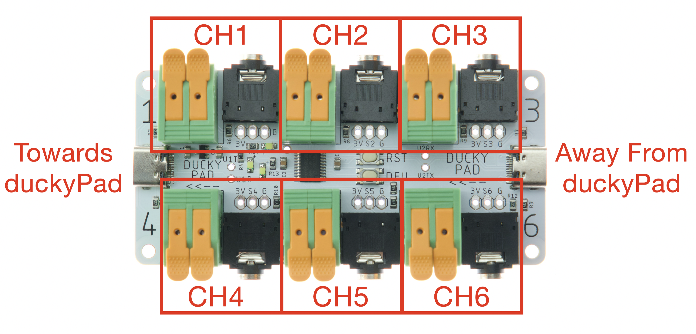
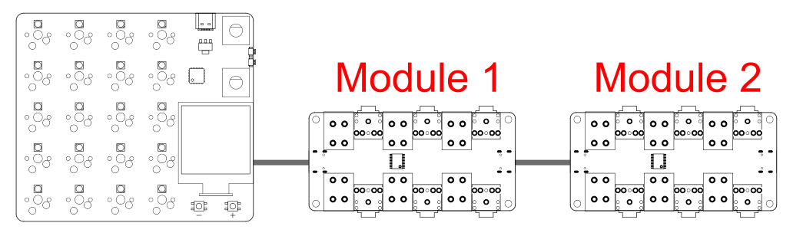

# duckyPad Pro Expansion Modules

duckyPad Expansion Modules lets you add external **switches / buttons / foot pedals** to your duckyPad Pro.

* **6 channels** per module

* **Daisy-chain** up to 5 modules with regular USB-C cable

## User Guide

Still writing! Check back later!

pinouts, terminal block and jack

how to wire up

how to set up in configurator

naming conventions

