# duckyPad Expansion Module

[Pre-order](https://www.kickstarter.com/projects/dekunukem/duckypad-pro-advanced-macro-scripting-beyond-qmk-via) | [Official Discord](https://discord.gg/4sJCBx5) | [Project Page](https://github.com/dekuNukem/duckyPad-Pro) | [Table of Contents](#table-of-contents)

duckyPad Expansion Module lets you wire up external **switches / buttons / foot pedals** to your duckyPad Pro.

* **8 Channels** Per Module

* **Daisy-Chain** up to 32 Channels

* USB-C Connector

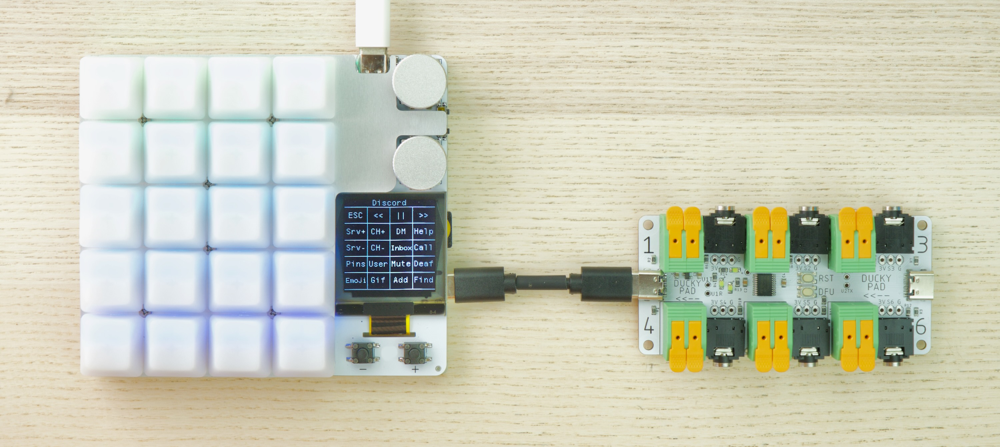

## Table of Contents

- [Kit Assembly](#kit-assembly)
- [Connection Overview](#connection-overview)
	- [Terminal Block](#connection-terminal-block)
	- [3.5mm Audio Jack](#connection-35mm-audio-jack)
	- [Pin Headers](#connection-pin-headers)
- [Key Test](#key-test)
- [Configurator](#configurator)

## Kit Assembly

* **Wash your hands first** to discharge static electricity

You should have the following parts:

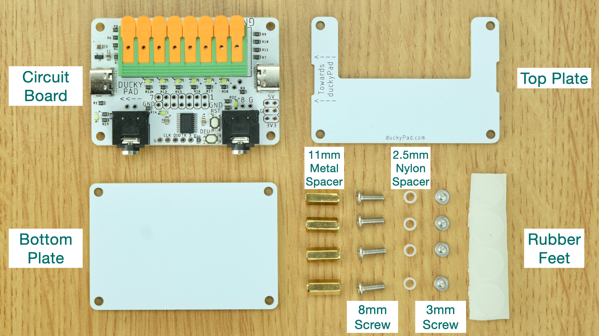

Insert the `8mm Screws` in `Bottom Plate`:

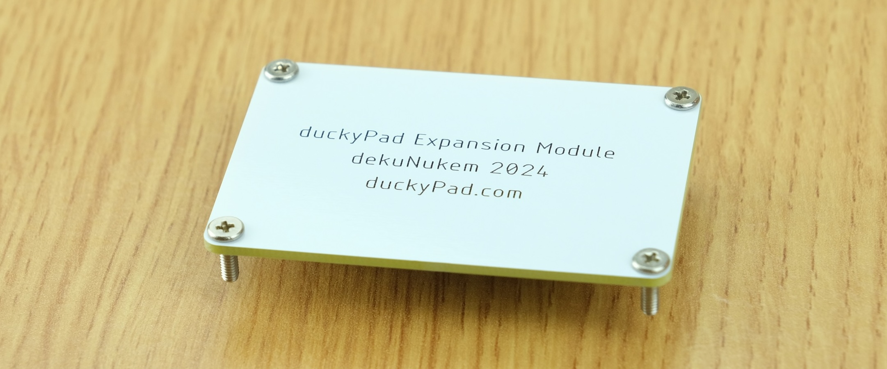

Place **something rigid** against the back, and flip over.

The screws should stay in place.

Put on **2.5mm Nylon Spacers**.

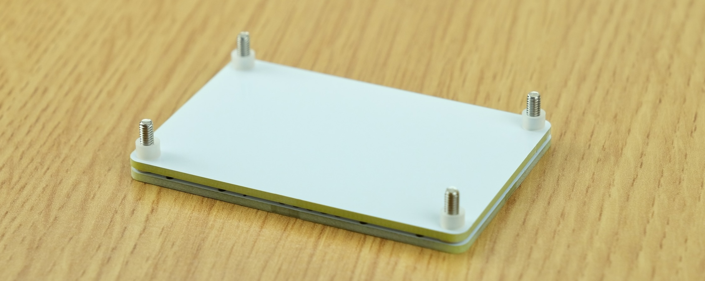

Insert the `Circuit Board`.

Then the `8mm Metal Spacer`

* **Moderately tighten** with a socket bit if available

* Avoid scratching the PCB or nearby components.

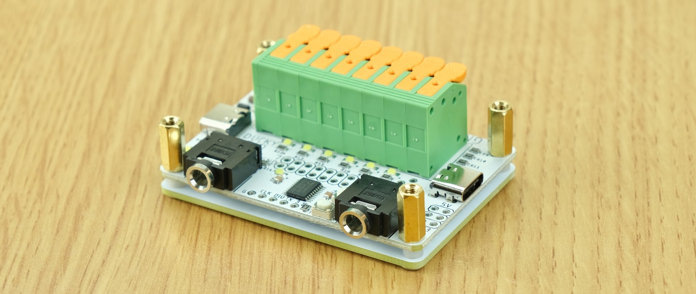

Leave the `Top Plate` off for now.

You can install it after everything is wired up.

## Connection Overview

**8 Channels** are available per module.

* Numbered 1 to 8
* A channel is **considered active** when it is **shorted to ground (GND)**.

Therefore, to wire up a switch, you just need to:

* Connect **one side** to **GND**
* And the **other side** to the **desired channel**

---------

You can make connections via:

* Terminal Block
* 3.5mm Jack
* Pin Headers

## Connection: Terminal Block

Take a look at the `terminal block`:

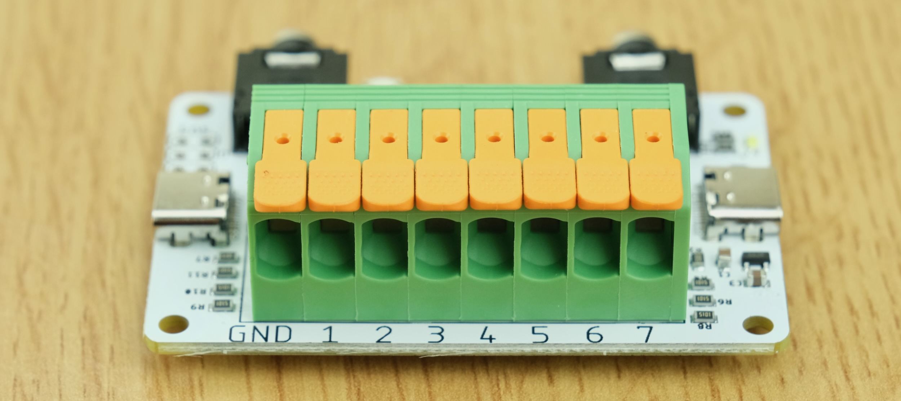

Contains **Channel 1 to 7** and **GND**

To wire up a switch, connect it between a channel and GND.

-------

As an example, here's a simple button with two wires:

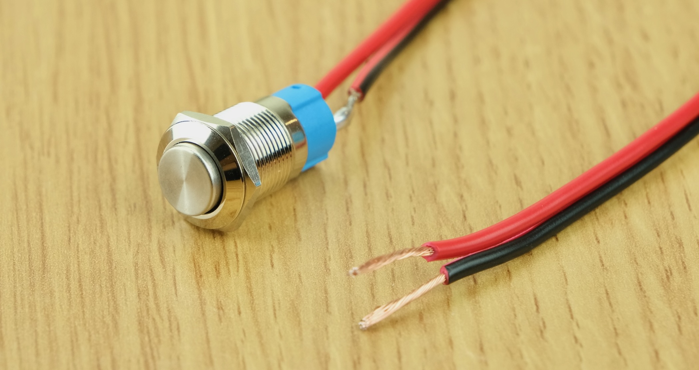

* When not pushed, the wires are isolated.
* When pushed, they are **connected together**.

Therefore, we just need to attach one wire to GND, and the other to a channel.

* Flip up the lever for GND and the desired channel

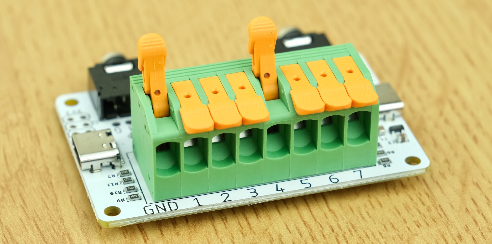

* Strip around half inch / 1.2cm of conductor
* Insert into the hole
* Flip lever back down

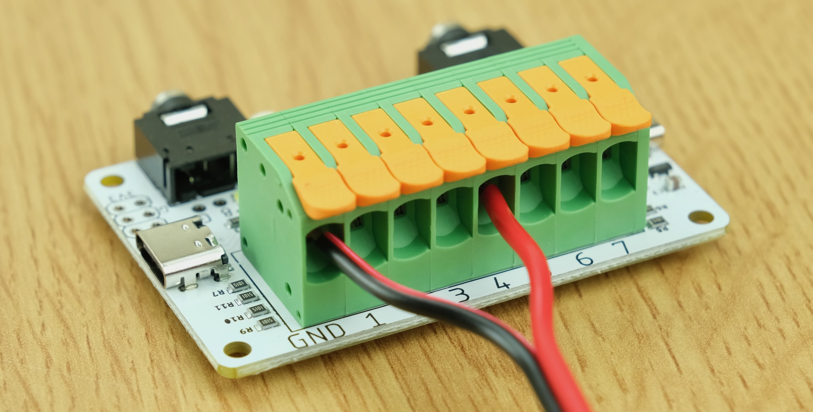

## Connection: 3.5mm Audio Jack

Two 3.5mm TRS (Tip, Ring, Sleeve) connectors are available.

Sleeve is connected to GND.

Tip and Ring are connected to channels shown below.

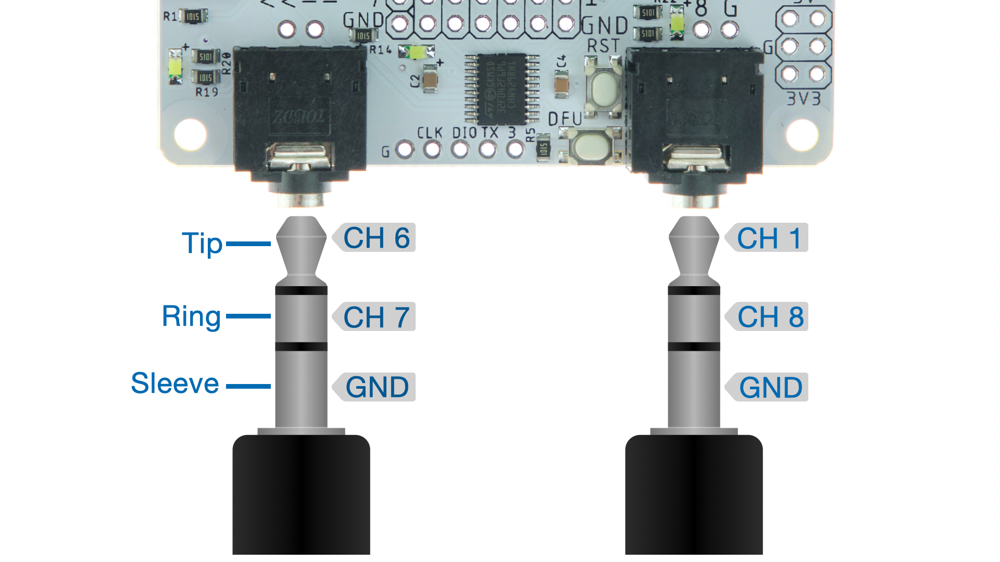

## Connection: Pin Headers

All channels are also available on pin headers.

You can install a header or solder wires directly to them.

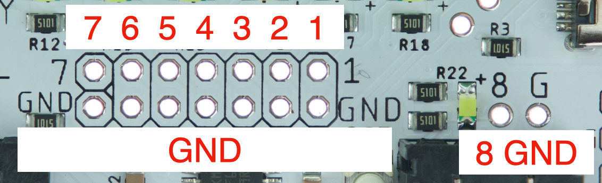

## Key Test

Use a USB-C cable and connect the module as shown.

* Make sure the `Towards duckyPad` marking faces duckyPad

* The other end is used for daisy-chaining

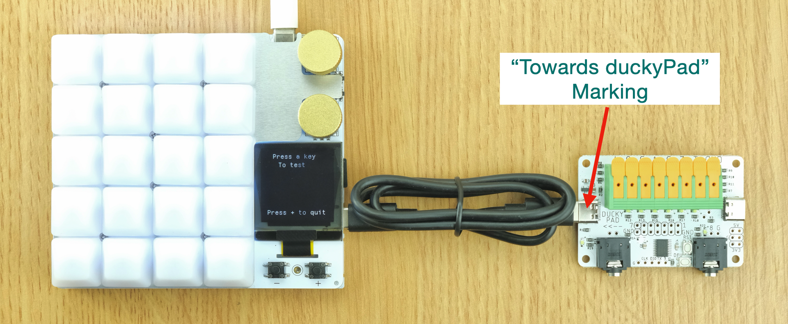

Press the `Key Test` script in `Welcome` profile

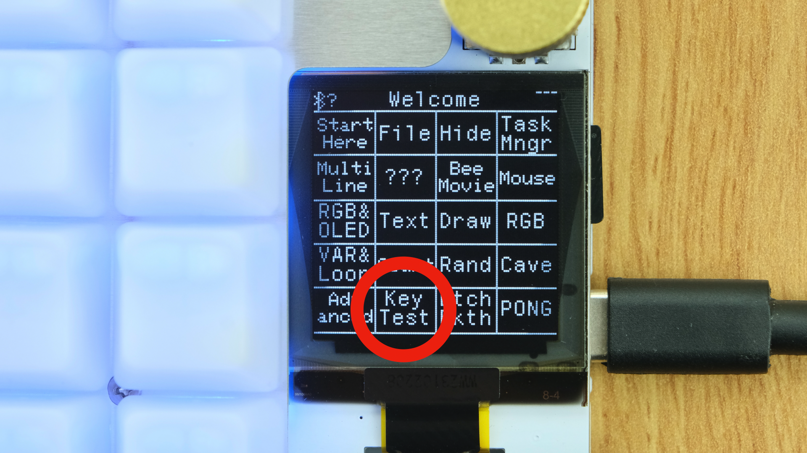

Press a button, the screen should show what is being pressed.

Activate a channel on the expansion module.

The corresponding LED should light up:

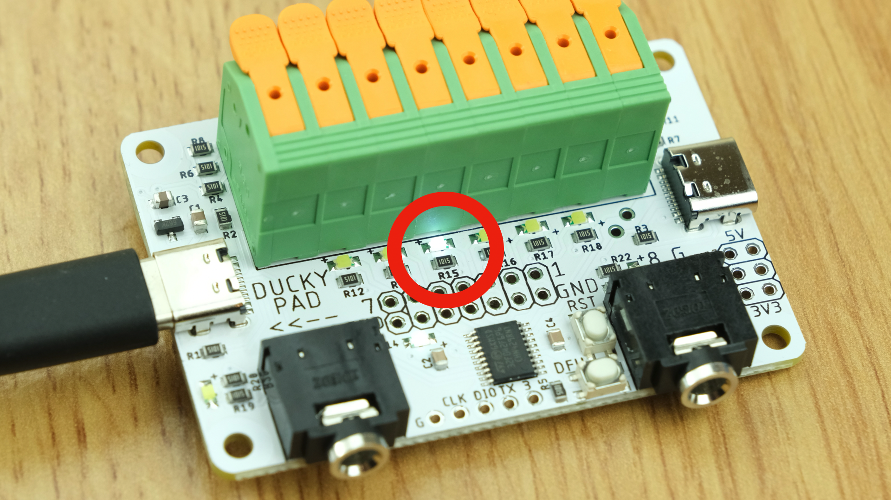

The screen should respond too:

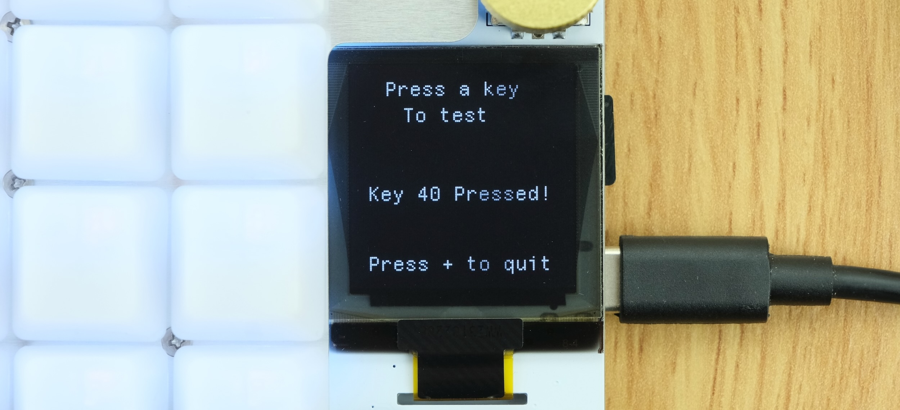

If so, congrats! The wiring is correct.

## Configurator

You can assign actions to expansion channels just like any other keys.

Module 1 is closest to duckyPad, up to 4 can be daisy-chained.

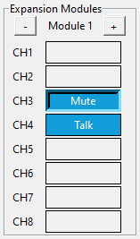

Some notes:

* If using a flip switch, select `Disable Auto-Repeat`.
* So the script doesn't repeat after changing state.

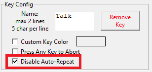

* Each channel can have different scripts for `onPress` and `onRelease`.
	* `onPress` is when a channel goes from inactive to active
	* `onRelase` is the opposite

## Questions or Comments?

Please feel free to [open an issue](https://github.com/dekuNukem/duckypad-pro/issues), ask in the [official duckyPad discord](https://discord.gg/4sJCBx5), or email `dekuNukem`@`gmail`.`com`!
